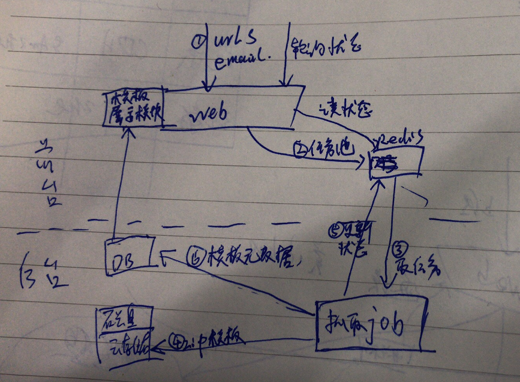

## 架构

## LOGO
https://image.baidu.com/search/index?tn=baiduimage&ipn=r&ct=201326592&cl=2&lm=-1&st=-1&fm=result&fr=&sf=1&fmq=1543832155706_R&pv=&ic=0&nc=1&z=0&hd=0&latest=0&copyright=0&se=1&showtab=0&fb=0&width=&height=&face=0&istype=2&ie=utf-8&word=%E6%B0%B4%E9%BB%BE+%E9%AB%98%E6%B8%85

## TODO
- 去重--------------ok
- 对象化 ----------ok
- 去重  ----------------ok
- 压缩---------------ok
- 移动UA选择，-------------ok
- 编码异常---------------------ok
- LOG -----------------------ok
- 动态-----------不做
- css路径替换--------------ok
- 是否抓站外链接 ---------ok
- 多线程or异步eventloop控制, 替换抓取分开，抓取多线程---------------------next
- 内嵌字体图片-----------------------ok
- 错误文件=》位置列表  =>  错误的文本写个空文本文件。文件名字不变 -------ok
- 替换路径相对的--------------ok

- eventloop-----------------------------------ok 是image名字为空导致的写目录问题
- 下载链接加入status---------------------------ok
- 已经有任务不能再次提交，加个验证码---------------ok
- django自动切换语言
- 邮件通知------------------------------ok
- lock表
-  超时 任务----------------------------ok
- download url
-  提交之前要检查email, 有没有I,P状态的--------------ok
--------------------------
- update returnning status 没改变问题
- 精品模版
- 截图
-  修了logging 为多线程之后不处理任务了

## 模版网站地址

https://www.wix.com/website/templates

http://wang.market/template.jsp

