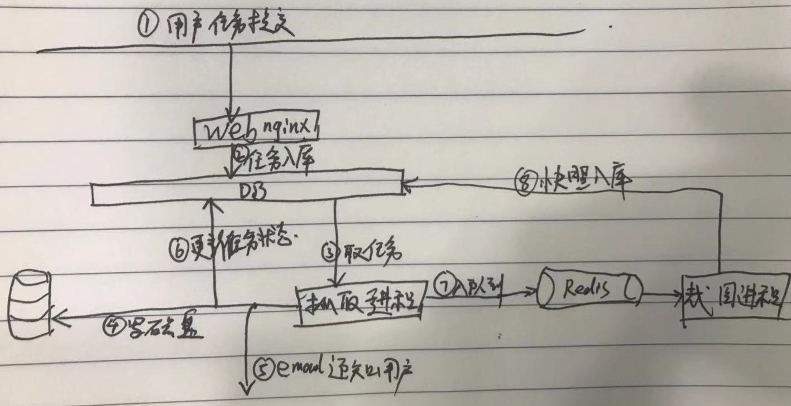

## 架构

## 部署
1. django静态文件
  执行 `python manage.py collectstatic`之后静态文件被放在 `tpl-spider-web`工程目录下的
   `collected_static/`。
  这个目录在`run.sh `里使用sed对nginx的配置 `tpl-spider-web.conf`进行了配置。
2. 下载的模版位置
  位置会存储下载过程中的临时目录和压缩后的zip文件。这个路径被配置在`run.sh`里。在启动的时候
  传送给 `tpl-spider-core`。

3. nginx(openresty) 配置
    - 首先需要root用户配置下nginx的自带配置文件`nginx.conf`， include 进去`$HOME/.nginx/*.conf`
      如果没有这个目录需要自己去建好
    - 第二步，把`tpl-spider-web`工程下的`tpl-spider-web.conf`文件软链接到`$HOME/.nginx/tpl-spider-web.conf`

4. 安装[pgmoon](http://leafo.net/guides/using-postgres-with-openresty.html)
    - 首先安装luarocks, 是管理lua包的。 `./configure --prefix=/opt/luarocks/  --with-lua=/opt/nginx/luajit/ --with-lua-include=/opt/nginx/luajit/include/luajit-2.1`
    - 去https://luarocks.org/ 看看支持postgres的包， 我们选 lua-resty-postgres
    - `sudo luarocks install --tree=/opt/openresty-1.15.8/luajit   pgmoon` 指定路径--tree别搞错，否则nginx找不到luarocks安装的库
    

## openrestry 安装

1. 下载源码   https://openresty.org/cn/ann-1015008001rc1.html 

2. 解压后进入源码根目录

3. 安装ngx_postgres模块需要自己编译时候加上，编译这个模块需要Libpq-dev。于是执行 `apt-get install libpq-dev` 

4.  `./configure --prefix=/opt/openrestry --with-http_postgres_module`  

5. `make`

6. `make install`

## TODO
- 精品模版
- 截图
- [logo](https://image.baidu.com/search/index?tn=baiduimage&ipn=r&ct=201326592&cl=2&lm=-1&st=-1&fm=result&fr=&sf=1&fmq=1543832155706_R&pv=&ic=0&nc=1&z=0&hd=0&latest=0&copyright=0&se=1&showtab=0&fb=0&width=&height=&face=0&istype=2&ie=utf-8&word=%E6%B0%B4%E9%BB%BE+%E9%AB%98%E6%B8%85
)

## 模版网站地址

https://www.wix.com/website/templates

http://wang.market/template.jsp

https://themes.getbootstrap.com/product/falcon-admin-dashboard-webapp-template/

https://themewagon.com/themes/bundle/